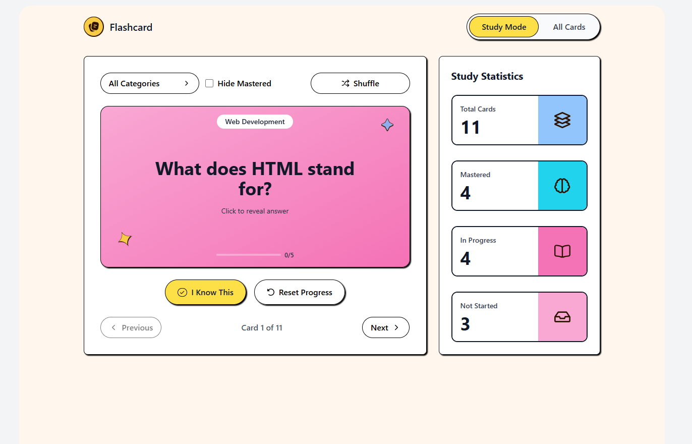

# Frontend Mentor - Flashcard app solution

This is a solution to the Flashcard app challenge on Frontend Mentor. Frontend Mentor challenges help you improve your coding skills by building realistic projects.

## Table of contents

- [Overview](#overview)
  - [The challenge](#the-challenge)
  - [Screenshot](#screenshot)
  - [Links](#links)
- [My process](#my-process)
  - [Built with](#built-with)
  - [What I learned](#what-i-learned)
  - [Continued development](#continued-development)
  - [Useful resources](#useful-resources)
- [Author](#author)
- [Acknowledgments](#acknowledgments)

## Overview

### The challenge

Users should be able to:

#### Flashcard Management

- Create new flashcards with a question, answer, and category
- Edit existing flashcards to update their details
- Delete flashcards they no longer need
- See form validation messages when trying to submit a card without all fields completed
- View all their flashcards in a grid layout
- See flashcard details including question, answer, category, and mastery progress

#### Study Mode

- Study flashcards one at a time in Study Mode
- Click on a flashcard to reveal the answer
- Mark a flashcard as known by clicking "I Know This" to track mastery progress
- Navigate between flashcards using Previous and Next buttons
- See which card they're currently viewing (e.g., "Card 1 of 40")
- Track mastery progress for each card on a scale of 0 to 5
- Reset progress on a flashcard to start learning it again

#### Filtering & Organization

- Filter flashcards by selecting one or multiple categories
- See the number of cards in each category within the filter dropdown
- Hide mastered cards to focus on cards that still need practice
- Shuffle flashcards to randomize the study order

#### Statistics & Progress

- View study statistics showing total cards, mastered, in progress, and not started counts

#### UI & Navigation

- Toggle between Study Mode and All Cards views
- Load more flashcards when viewing the full card list with more than 12 cards
- See a toast message when a card is created, updated, or deleted
- View the optimal layout for the interface depending on their device's screen size
- See hover and focus states for all interactive elements on the page
- Navigate the entire app using only their keyboard

### Screenshot

### Links

- Solution URL: https://github.com/khatupham1996/Flashcard-App
- Live Site URL: https://flashcard-khatu.vercel.app/

## My process

### Built with

- React - JavaScript library for building user interfaces
- Vite - Next generation frontend tooling
- Tailwind CSS - Utility-first CSS framework
- React Context API - For state management
- Custom Hooks - For reusable logic (navigation, mastery tracking, toasts)
- PropTypes - For type checking component props
- CSS Grid & Flexbox - For responsive layouts
- Mobile-first workflow - Ensuring mobile responsiveness first

### What I learned

This project reinforced several key React concepts and patterns:

1. Context API for Global State Management: I learned how to use React Context to manage modal states across components without prop drilling.
2. Custom Hooks for Reusable Logic: Creating custom hooks helped organize complex logic.
3. useMemo for Performance Optimization: Using useMemo to prevent unnecessary re-renders when filtering flashcards.
4. Component Composition: Breaking down the UI into small, reusable components with clear responsibilities made the code more maintainable and testable.
5. Controlled Components: Managing form inputs with React state for full control

### Continued development

1. TypeScript Integration: Moving from PropTypes to TypeScript for better type safety.
2. Testing: Implementing unit and integration tests with React Testing Library.
3. Accessibility: Improving keyboard navigation and screen reader support
4. Data Persistence: Adding localStorage or database integration to save flashcards.
5. Animation: Adding more smooth transitions using Framer Motion.
6. Performance: Implementing virtualization for large flashcard lists.
7. Advanced Features: Spaced repetition algorithm, study sessions, and analytics.

### Useful resources

1. React Documentation: Essential for understanding hooks and component patterns
2. Tailwind CSS Documentation: Comprehensive guide for utility classes
3. React Context Best Practices: Helped structure the context implementation
4. Custom Hooks Guide: Great resource for creating reusable logic
5. useMemo vs useCallback: Clarified when to use performance optimization hooks

## Author

- Website - [Kha Tu Pham](https://www.your-site.com)
- Frontend Mentor - [@khatupham1996](https://www.frontendmentor.io/profile/khatupham1996)
